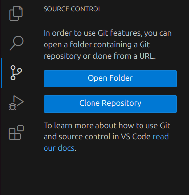
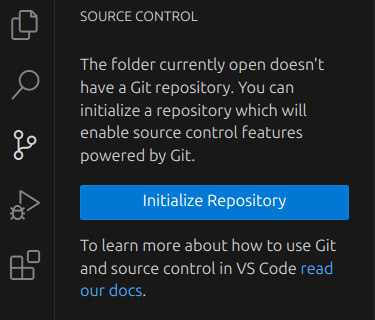
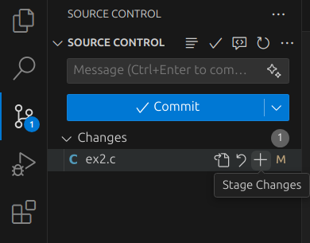
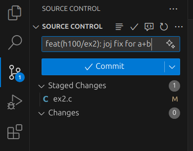
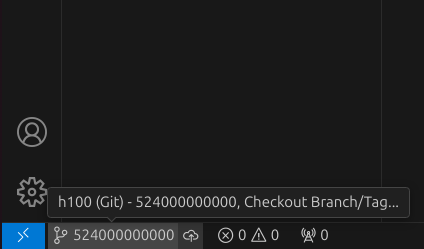
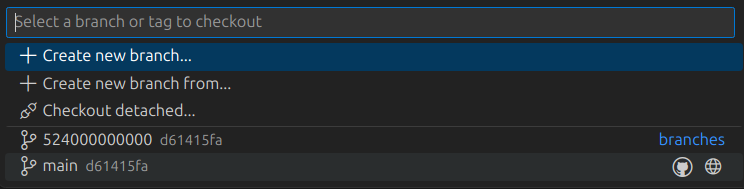
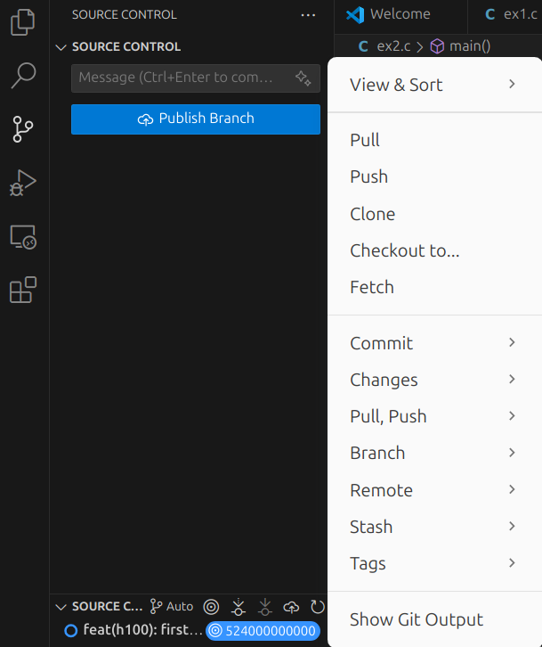

## Prerequisites

- **Git** must be installed on your system. Verify with:
  ```bash
  git --version
  ```

- **Visual Studio Code** (v1.XX or later)  
  VS Code includes built-in Git support out of the box.

---

## 1. Clone a Repository

- Open the **Source Control** panel on the Sidebar(`Ctrl+Shift+G`).
- Click **Clone Repository**.
- Enter the repository URL and choose a local folder to clone into.

  
  

## 2. Initialize a New Repository

- Open the **Source Control** panel on the Sidebar (`Ctrl+Shift+G`).
- Click **Initialize Repository**.
- VS Code creates a `.git` folder and shows all untracked files under *Changes*.

  

---

## 3. Staging & Committing Changes

- In **Source Control**, hover over a file under *Changes* and click the ➕ icon to stage it.
- Alternatively, right-click and select **Stage Changes**.
- Once staged, enter a commit message in the input box at the top.
- Click the ✔️ **Commit** button or press `Ctrl+Enter`.

  
  

---

## 4. Branching & Merging

- Click on the current branch name (e.g., `main`) in the status bar.
- Select **Create new branch**, enter a name, and press Enter.
- To switch branches, click the branch name again and choose another branch.
- To merge:
  - Open the Command Palette (`Ctrl+Shift+P`)
  - Run `Git: Merge Branch`
  - Select the target branch to merge into the current one.

  
  

---

## 5. Pull, Push & Remote Operations

- **Pull**: Click the `…` menu in Source Control, then **Pull**, or run `Git: Pull` in the Command Palette.
- **Push**: After committing, click the Push icon in the status bar or run `Git: Push`.

  

---
